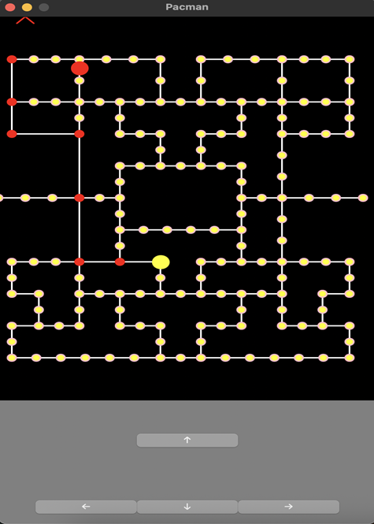

# 🟡 Pacman — Functional Reactive Programming

A Pacman-style desktop game built in **Haskell** using **Functional Reactive Programming (FRP)**. The project combines reactive event handling, immutable game state, graph-based maze navigation, and goal-directed ghost behavior.

<p align="center">
  
</p>

<p align="center">
  <b>Haskell</b> · <b>Functional Reactive Programming</b> · <b>Reactive.Banana</b> · <b>wxWidgets</b>
</p>

## 🎮 Features

| Feature         | Description                                         |
| --------------- | --------------------------------------------------- |
| 🟡 Pacman       | Player-controlled movement through the maze         |
| 👻 Ghost AI     | Goal-directed navigation with chase/scatter modes   |
| 🟠 Collectables | Pellet collection and win-state tracking            |
| 🗺️ Maze Graph  | Node-based representation of connected paths        |
| ⚡ FRP           | Reactive event and behavior-based game architecture |
| 🎯 Collision    | Pacman/ghost collision and game-over handling       |
| ⏯️ Game Control | Pause, restart and quit functionality               |
| 🖥️ GUI         | Desktop interface built with wxWidgets              |

## 🧠 Technical Highlights

### Functional Reactive Architecture

The game uses **Reactive.Banana** to model the application's changing state through events and behaviors.

```text
User Input ──────┐
                 │
Timer Events ────┼──► FRP Event Network
                 │          │
Game Events ─────┘          ▼
                       World Update
                            │
              ┌─────────────┼─────────────┐
              ▼             ▼             ▼
           Pacman         Ghost       Collectables
              │             │             │
              └─────────────┼─────────────┘
                            ▼
                       Game Status
                            │
                            ▼
                         Render
```

### Ghost Navigation

Ghost movement is based on the maze's connected nodes. At decision points, the ghost evaluates possible directions and selects a path toward its current goal.

Ghost behavior also supports different modes, including:

* **Chase** — target Pacman's position
* **Scatter** — move toward a predefined maze position

### Graph-Based Maze

The maze is represented using connected nodes rather than arbitrary screen coordinates. This provides a structured navigation model for both Pacman and ghosts.

## 🛠️ Tech Stack

```text
Language       Haskell
Architecture   Functional Reactive Programming
FRP            Reactive.Banana / Reactive.Banana.WX
GUI            wxWidgets / wxcore
Build          Cabal
Data           HashMap
Concepts       Event-driven programming · State management · Graph navigation
```

## 📁 Project Structure

```text
Pacman/
├── app/
│   ├── Main.hs
│   ├── Game.hs
│   ├── Pacman.hs
│   ├── Ghost.hs
│   ├── Collectable.hs
│   ├── Node.hs
│   ├── Modes.hs
│   ├── Entity.hs
│   ├── Helper.hs
│   ├── Vec.hs
│   └── Constants.hs
│
├── data/
│   ├── maze1.txt
│   ├── mazetest.txt
│   └── mazetest2.txt
│
├── Pacman.cabal
└── cabal.project
```

## 🚀 Getting Started

### Prerequisites

* [GHC](https://www.haskell.org/ghc/)
* [Cabal](https://www.haskell.org/cabal/)
* wxWidgets / wxHaskell dependencies

### Build

```bash
cabal build
```

### Run

```bash
cabal run
```

## 🎥 Demo

Add a gameplay GIF here once available:

```markdown

```

<p align="center">
  <i>Built to explore Functional Reactive Programming through an interactive application.</i>
</p>
